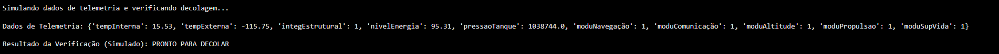
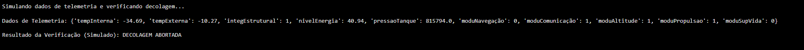

*Telemetria Aurora Siger*
---

Este projeto consiste em um sistema de telemetria para monitoramento e análise de dados de pré-decolagem da aeronave Aurora Siger. O sistema automatiza a coleta, transmissão e processamento de parâmetros críticos para garantir a segurança e operacionalidade da missão.

---

*Visão Geral*

O sistema de telemetria opera em três etapas fundamentais:

1. Captura de Dados: Sensores coletam dados físicos (temperatura, pressão, energia) e status de integridade.

2. Transmissão: Dados são enviados automaticamente para uma estação receptora via ondas de rádio, satélite ou redes celulares.

3. Recepção e Processamento: Decodificação e análise em tempo real para identificação de tendências ou anomalias.

---

*Parâmetros Monitorados*

|Parâmetro|Unidade/Formato|Faixa de Operação Segura|
|---|---|---
|Temperatura Interna|°C|-10°C a 40°C|
|Temperatura Externa|°C|-120°C a 120°C|
|Integridade Estrutural|0 (Falha) / 1 (OK)|1 (Intacta)|
|Níveis de Energia|%|> 95%|
|Pressão dos Tanques|Pa|700.000 Pa a 1.200.000 Pa|
|Status dos Módulos|0 (Falha) / 1 (OK)|1 (Operacional)|

---

*Algoritmo de Verificação*

O projeto inclui um algoritmo de verificação de decolagem que determina se a aeronave está em condições seguras.

Funcionalidades do Script Python:

* Simulação de Leitura de Dados: Geração de dados aleatórios dentro e fora das faixas de segurança.

* Lógica de Decisão: Verifica se todos os parâmetros atendem aos critérios rigorosos de segurança.

* Relatório de Status: Exibe o resultado como "PRONTO PARA DECOLAR" ou "DECOLAGEM ABORTADA".

---

*Instruções de Execução*

Para executar o script de telemetria e verificar a decolagem, siga os passos abaixo:

1. Abra o arquivo telemetria.ipynb

2. Altera os valores das faixas do numeros randomicos para simular de uma falha ou uma decolagem com base nos parametros seguros.

3. Execute o bloco de codigo que se encontra no 1.3

---

*Simulando decolagem*

*Simulando falha*

